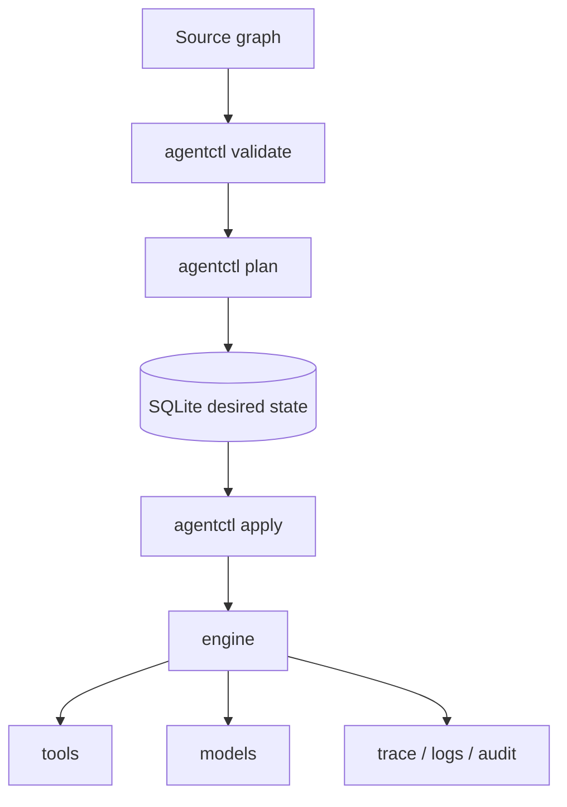

# Architecture

Agentic Control Plane is a **statically analyzable, capability-oriented execution platform for nondeterministic programs**. It bounds and diffs the **authority granted** to agents, tools, and workflows. It does **not** verify what remote systems do with that authority ([ADR 002](adr/002-language-frontend-and-ir-expressiveness.md)).

This note is the README diagram expanded. Field semantics and the engine internals live in [`DESIGN_DOC.md`](DESIGN_DOC.md) §12.

## Pipeline

| Stage | What happens |
|-------|----------------|
| **Source graph** | Versioned resources (`Project`, `Agent`, `Tool`, `Workflow`, `Policy`, `Environment`). Today that graph is YAML — interchange / compilation output, not the long-term authoring surface. [`.agent`](adr/002-language-frontend-and-ir-expressiveness.md) is planned ([#200](https://github.com/LAA-Software-Engineering/agentic-control-plane/issues/200)). |
| **validate / plan** | Load, normalize, overlay environments, lint policy, then **diff** desired graph vs SQLite deployment state. Plan output includes field diffs plus C1 `RiskItem`s (permissions, approvals, models, budgets, tool surface). |
| **SQLite desired state** | Applied resources live in `.agentic/state.db` (override with `--state`). Deployment rows are separate from run traces in the same file. |
| **engine** | `agentctl run` executes a workflow against the applied snapshot. Policy gates tool calls; HITL / `--approve` / fail-closed denials are recorded. |
| **tools + models** | Native, HTTP, mock, and MCP tools; OpenAI / Anthropic / mock models. Agents may only call advertised `uses` strings. |
| **trace / logs / audit** | Hash-linked `trace_events`. `agentctl logs` reads them; `agentctl audit verify` re-walks the chain. |

## Plan-time bounds (shipped vs direction)

The uncopyable capability is a **plan-time effect bound**: a sound static upper bound on what an autonomous agent can do, reviewable as a diff ([#189](https://github.com/LAA-Software-Engineering/agentic-control-plane/issues/189) / [#191](https://github.com/LAA-Software-Engineering/agentic-control-plane/issues/191)). Compute over the desired graph is [`internal/effects.Compute`](../internal/effects) (#189); plan output of bounds/deltas is **not shipped** (#191).

**What `agentctl plan` already diffs today:**

- Tool **permissions** (`spec.permissions.allow`)
- Policy **approvals** (`approvals.requiredFor`) and **budgets** (cost / wall-clock)
- Agent **models** and **tool surface**
- C1 **risk items** (`permission_widening`, `approval_removal`, `budget_relaxation`, `model_change`, `tool_surface_change`, plus safety/lint)

See the sample `plan` table in the [README](../README.md#the-differentiator-plan-time-bounds-on-authority).

## Closed world (soundness)

An effect bound is only sound if the world of operations is closed. Dynamically discovered MCP tools must be pinned to a **deployed manifest**; otherwise the static upper bound is unsound. ACP still does not claim to verify side effects inside pager, GitHub, or a shell — only that the **grant** (which `uses` strings, which permissions, which ceilings) is what `plan` showed and `apply` stored.

## Flagship path

[`examples/incident-triage`](../examples/incident-triage) is the first-screen walkthrough: declared tools, fail-closed restart, exit **5** without `--approve`, tamper-evident audit after a successful run.
